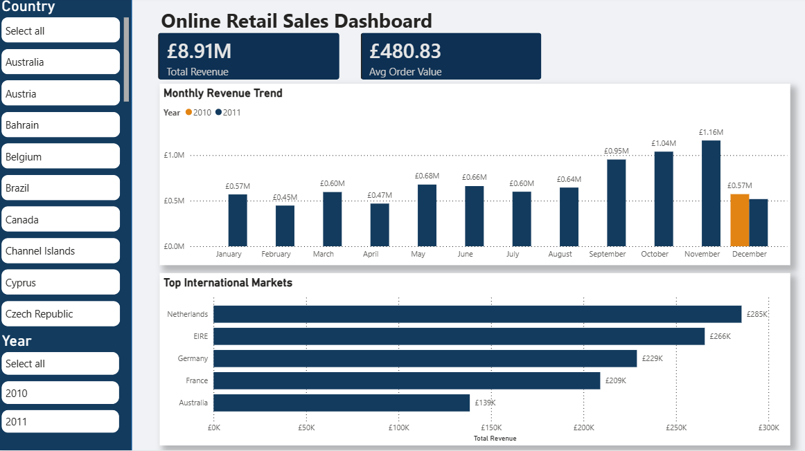

# Online Retail Sales Dashboard 📊



## Overview
This project is an interactive Power BI dashboard designed to analyze retail sales data, track Year-over-Year (YoY) growth, and identify high-value international markets. The goal was to transform raw transaction logs into actionable insights for executive decision-making.

## Data Source
The dataset used for this project is the **Online Retail II** Data Set from the UCI Machine Learning Repository.
* **Source:** [UCI Machine Learning Repository](https://archive.ics.uci.edu/ml/datasets/Online+Retail+II)
* **Description:** A trans-national data set containing all transactions occurring between 01/12/2009 and 09/12/2011 for a UK-based and registered non-store online retail.

## Business Problem
The raw "Online Retail II" dataset contained uncleaned transaction records with inconsistencies in currency and negative quantities (returns). The specific challenges were:
1. **Data Noise:** Raw data included returns and cancellations that skewed revenue figures.
2. **Market Dominance:** The UK market accounted for >90% of sales, making it difficult to analyze the performance of international expansion efforts.
3. **Incomplete Comparison:** The dataset contained limited data for 2010 vs. a full year for 2011, requiring careful visualization of trends.

## Solution & Key Features
1. **Data Cleaning:** Filtered invalid transactions (negative quantities) and standardized currency formatting to GBP (£).
2. **Dynamic DAX Measures:** Avoided implicit column aggregation to ensure accurate KPIs at the transaction level.
3. **Contextual Filtering:** Implemented "Top N" filtering to generate leaderboards for non-domestic markets, revealing the Netherlands and EIRE as top secondary markets.
4. **Time Intelligence:** Modeled Year-over-Year (YoY) comparisons to highlight the Q4 2011 sales surge against partial 2010 data.

## Technical Implementation (DAX)
### 1. Total Revenue
```Calculated the sum of line totals to handle row-level granularity rather than aggregate averages. Total Revenue = SUM('Year 2010-2011'[Sales Amount]) ```

### 2. Average Order Value (AOV)
```Calculated the average spend per unique invoice to determine the true "basket size," providing a more accurate metric than simple average unit price. Avg Order Value = DIVIDE([Total Revenue], DISTINCTCOUNT('Year 2010-2011'[Invoice])) ```


## Tech Stack
* **Tool**: Microsoft Power BI Desktop
* **Languages**: DAX (Data Analysis Expressions), M (Power Query)
* **Techniques**: Data Modeling, ETL, Data Visualization
